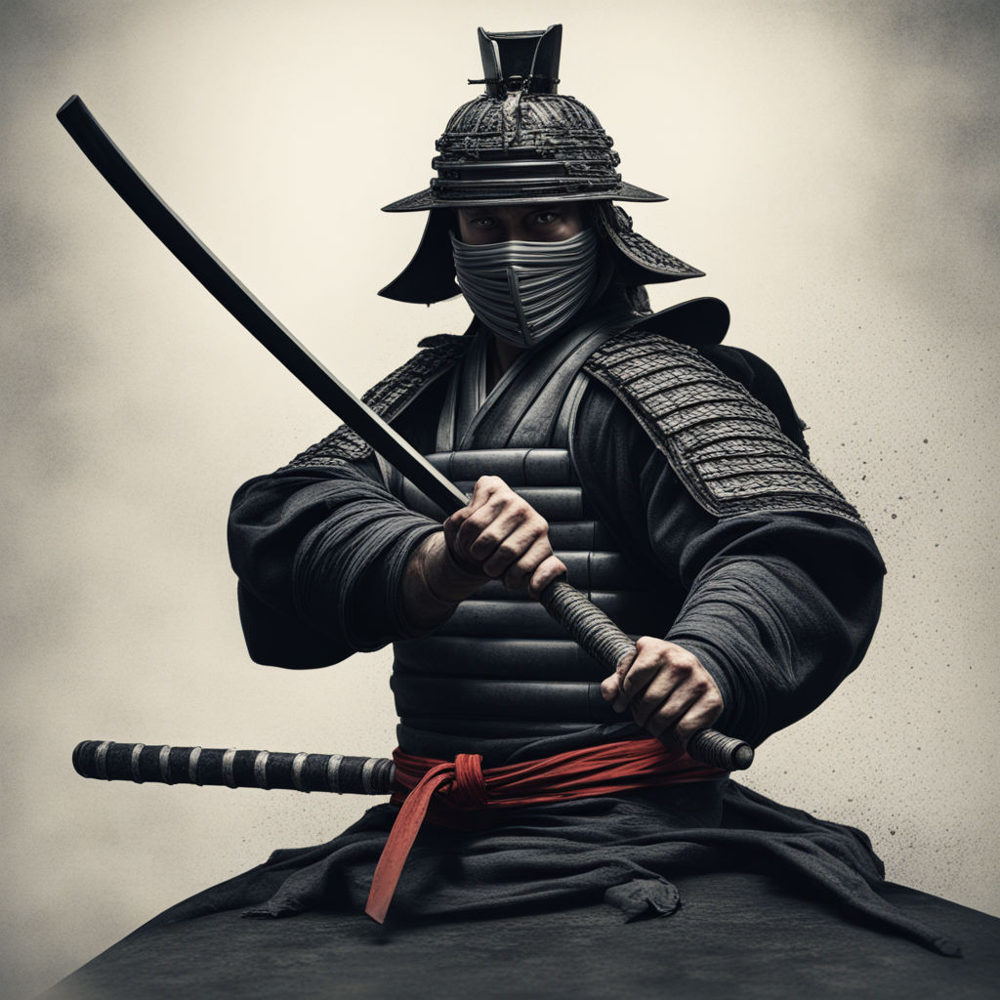
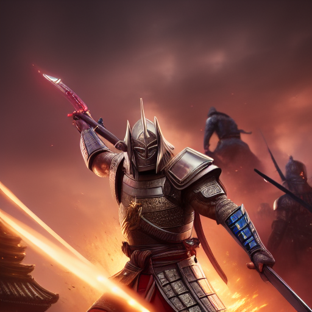
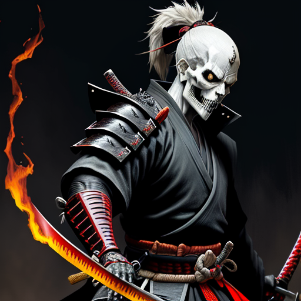

# SamuraiSword.pygame

## 목차(Korean)
1. [게임 방법](#1-게임-방법)
2. [코드 참조](#2-코드-참조)
3. [저작권 정보](#3-저작권-정보)
4. [플레이 동영상](#4-플레이-동영상)
5. Explanation in English

## 1. 게임 방법
### 개요
상대와 공격을 주고받는 게임입니다. 

**공격**, **방어**, **폭탄 회피**를 통해 상대의 체력을 0으로 만드세요.

게임은 총 세 레벨로 구성되어 있습니다.

- 레벨에 따라 도트의 크기, 종류, 자신의 공격력, 받는 피해, 도트가 사라지는 속도가 변합니다.

- 레벨 3에서는 방어해도 5의 피해를 입습니다.

- 다음 레벨에 진입해도 체력은 회복되지 않습니다. 주의 깊게 플레이하세요.

### 도트 설명
- 빨간 도트의 등장 (적의 약점): 빨간 도트를 마우스로 그어 공격하세요.

- 파란 도트의 등장 (적의 공격 스탠스): 곧 공격이 옵니다. 화면 상단에 마우스를 놓아 방어하세요.

- 검은 도트의 등장 (폭탄): 레벨 3부터 등장합니다. 마우스를 움직이다가 검은 점에 마우스가 닿으면 30의 피해를 입습니다.

## 2. 코드 참조
Chat-GPT를 통해 생성된 스켈레톤 코드를 기반으로 보완 및 수정하여 작성되었습니다.

참조한 코드는 그 뿐입니다.

## 3. 저작권 정보
- 배경음악은 NoCopyrightsSounds의 음악을 사용하였습니다. [해당 유튜브 링크](https://www.youtube.com/@NoCopyrightSounds) 참고.

- 이미지는 Playground AI에서 생성되었습니다. [관련 공지](http://help.playgroundai.com/en/articles/6848773-how-does-copyright-work-do-i-own-the-images-i-create) 확인.

- 효과음은 freesound.org의 'CC0' 등급만 사용하였습니다. [CC0 정보](https://creativecommons.org/publicdomain/zero/1.0/) 확인.

### <배경음악 사용시 규정상 꼭 첨부해야하는 글>

- - - - - - - - - - - - - - - - - - - - - - - - - - - - - - - - - - - - - -

When you are using this track, we simply ask that you put this in your description:

Track: Jim Yosef - Samurai [NCS Release]
Music provided by NoCopyrightSounds.
Watch:
Free Download / Stream: http://NCS.io/Samurai

- - - - - - - - - - - - - - - - - - - - - - - - - - - - - - - - - - - - - -

When you are using this track, please add this in your description:

Track: VØJ & ATSMXN - Blade Fury [NCS Release]
Music provided by NoCopyrightSounds.
Watch: https://ncs.lnk.to/bladefuryAT/youtube
Free Download / Stream: http://ncs.io/bladefury

- - - - - - - - - - - - - - - - - - - - - - - - - - - - - - - - - - - - - -

## 4. 플레이 동영상

https://github.com/singsingsing3/SamuraiSword.pygame/assets/120327265/2045b918-ea2b-40ff-b20d-e22d1d87ebcc

- - - - - - - - - - - - - - - - - - - - - - - - - - - - - - - - - - - - - -

## Table of contents (English)
1. [How to play](#1-How to play)
2. [Code Reference](#2-Code-Reference)
3. [Copyright Information](#3-Copyright-Information)
4. [Play Video](#4-Play-Video)

## 1. How to play
### outline
It is a game where you exchange attacks with your opponent.

Make your opponent's health to 0 through **Attack**, **Defense**, and **Bomb Evasion**.

The game consists of a total of three levels.

- Depending on the level, the size and type of the dot, your attack power, damage received, and the speed at which the dot disappears change.

- At level 3, you take 5 damage even if you block.

- Your HP does not recover even after leveling. Please play carefully.

### Dot Description
- Appearance of red dot (enemy weakness): Draw the red dot with the mouse to attack.

- Appearance of a blue dot (enemy's attack stance): An attack is coming soon. Hover your mouse at the top of the screen to defend.

- Appearance of black dots (bomb): Appears from level 3. If you move your mouse and it touches the black dot, you will take 30 damage.

## 2. Code reference
It was created by supplementing and modifying the skeleton code generated through Chat-GPT.

That's all the code I referenced.

## 3. Copyright information
- The background music is from NoCopyrightsSounds. Refer to [corresponding YouTube link](https://www.youtube.com/@NoCopyrightSounds).

- Image was created by Playground AI. Check [Related Notice](http://help.playgroundai.com/en/articles/6848773-how-does-copyright-work-do-i-own-the-images-i-create).

- Only freesound.org's 'CC0' grade was used for sound effects. Check [CC0 information](https://creativecommons.org/publicdomain/zero/1.0/).
